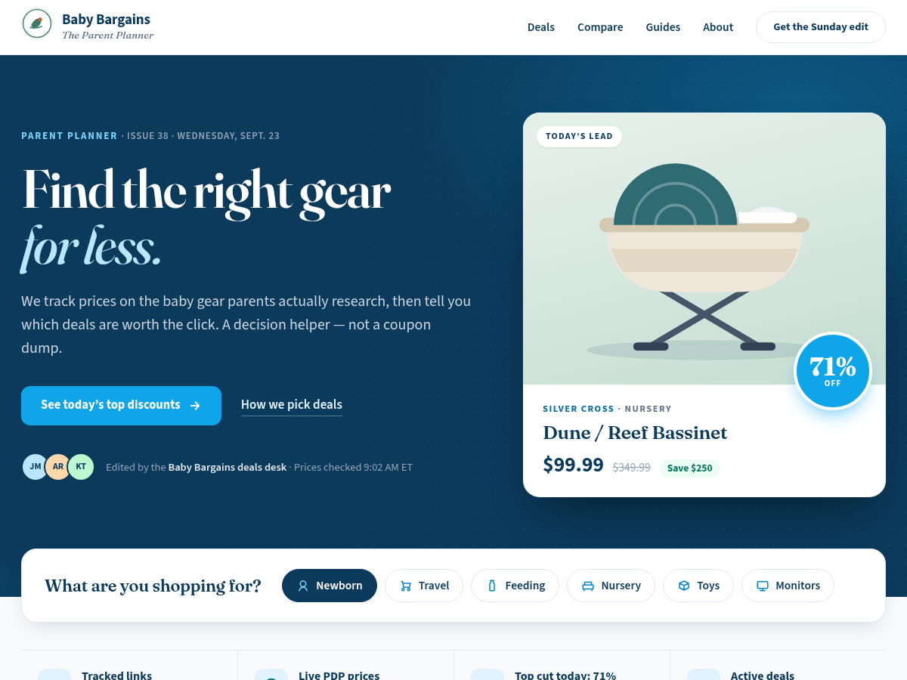

# Baby Bargains Parent Planner (block theme)

A WordPress block theme for baby-bargains.com that implements **Parent Planner Mock 1 — Editorial magazine**. The source of truth for layout and visuals is [`parent-planner/mock-1-editorial.html`](../../parent-planner/mock-1-editorial.html).

The theme is built only from core blocks, with no plugins and no build step. Everything stays editable in the Site Editor, and posts are still written in the normal block editor.



## What's inside

| Path | Purpose |
| --- | --- |
| `style.css` | Theme header plus the Mock 1 visual layer: cards, badges, chips, compare table and breakpoints |
| `theme.json` | Brand tokens: palette (navy `#0B3A5B`, sky `#0EA5E9`, bg `#F8FAFC`, muted `#64748B`, border `#E2E8F0`, …), Fraunces serif headings, Source Sans 3 body, spacing, shadows, 1144px wide layout |
| `functions.php` | Loads the stylesheet on the front end and in the editor, and registers the "Baby Bargains" pattern category and block styles (Chip, Ghost, Card, Deal compare) |
| `templates/` | `front-page`, `index`, `single`, `page`, `page-wide` ("Page (wide, no title)"), `archive`, `search`, `404` |
| `parts/` | `header` (sticky, with a hamburger menu on mobile) and `footer`. Both load their markup from `patterns/header.php` and `patterns/footer.php` |
| `patterns/` | Homepage sections, listed below |
| `assets/fonts/` | Self-hosted Fraunces and Source Sans 3 (latin, variable). Both are SIL Open Font License |
| `assets/images/` | Placeholder product art taken from the mock (SVG) and the logo |

### Patterns (Inserter → Patterns → **Baby Bargains**)

The homepage (`templates/front-page.html`) uses these patterns, in this order:

1. **Navy hero with lead deal**: full-bleed navy hero, serif H1 ("Find the right gear *for less.*"), CTA, deals-desk byline and the lead-deal cover card.
2. **Need chips**: the "What are you shopping for?" panel that overlaps the hero.
3. **Trust strip**: tracked links, live PDP prices, today's top cut, and the active-deal count.
4. **The Edit: magazine feature grid**: one large feature card with two stacked cards beside it.
5. **Deal cards (3-up grid)**: "More deals today".
6. **Quick compare table**: a secondary, side-by-side table (a core Table block with the "Deal compare" style).
7. **Buying guides (3-up)**: numbered guide cards.
8. **Sunday edit newsletter**: newsletter call-to-action.

There is also a reusable **Section heading** pattern: navy rule, eyebrow, serif H2 and a "more" link.

**Deal content is sample data.** The products, prices, discounts, dates and issue number are copied from the mock (Silver Cross Dune / Reef 71% off, and so on) so the layout can be reviewed. Replace them before launch. **Every CTA and "View deal" link is a `#` placeholder.** No affiliate URLs are included. Put the tracked retailer links in when you edit each block.

Things to swap before launch:

- **Newsletter button**: it's a placeholder. In the Site Editor, replace it with the Jetpack **Subscribe** block (Atomic sites include Jetpack) or your email provider's form.
- **Navigation**: the header menu uses inline links to homepage anchors (`/#edit`, `/#compare`, `/#guides`, `/#about`). If you'd rather use an existing site menu, select the Navigation block and choose it. The "Get the Sunday edit" item only shows inside the mobile menu.
- **Footer "About" links**: these are `#` placeholders. Point them at your How-we-pick, Affiliate disclosure and Contact pages.

## Build the zip

The zip has to contain the `babybargains-parent-planner/` folder, with `style.css` directly inside it. From the repo root:

```bash
cd theme
zip -r babybargains-parent-planner.zip babybargains-parent-planner -x '*.DS_Store'
```

This creates `theme/babybargains-parent-planner.zip` (about 0.5 MB).

## Install on baby-bargains.com (WordPress.com Atomic)

Nothing in this repo touches the live site. Cutover is a manual step. The site currently runs **Assembler**, and none of these steps change or delete Assembler's templates. Assembler stays installed, so you can switch back at any time.

1. **Upload**: in wp-admin, go to **Appearance → Themes → Add New Theme → Upload Theme**. Choose `babybargains-parent-planner.zip` and click **Install Now**. You can also use WordPress.com's **Appearance → Themes → Install new theme → Upload theme** screen.
2. **Preview first (recommended)**: on the "Theme installed successfully" screen, or on the theme's card, click **Live Preview**. This opens the Site Editor with the new theme without activating it. Check the homepage, a post, and a category page.
3. **Activate**: go to **Appearance → Themes → Baby Bargains Parent Planner → Activate**.
4. **Front page**: the theme's **Front Page** template (`front-page.html`) is used for the homepage automatically. WordPress gives it precedence over every other template, whatever the Reading settings say. After activating:
   - Open **Settings → Reading**. Either setting works:
     - **Your latest posts**: the homepage shows the Parent Planner front page. There is no separate blog listing page, but category, tag and search archives still work.
     - **A static page**: set **Homepage** to any page (for example "Home"). The Front Page template still renders it. Set **Posts page** to a page such as "Deals & guides" to get the card-grid post listing (`index.html`).
   - To edit homepage deals, go to **Appearance → Editor → Templates → Front Page**. The sections are normal blocks, so you can edit text, prices, images and links in place, then **Save**.
   - If you'd rather manage the homepage as a regular Page, set a static homepage, assign it the **Page (wide, no title)** template, and insert the Baby Bargains patterns into it. Then delete or rename `front-page.html` in a later version of the theme. Otherwise it will keep overriding that page.
5. **Site title**: the header and footer use the Site Title block, so make sure **Settings → General → Site Title** is "Baby Bargains". The "The Parent Planner" tagline under the logo is static text in the header/footer patterns.
6. **Check the header** at phone width. The hamburger button (48×48) opens a full-screen menu.

To roll back, re-activate Assembler under **Appearance → Themes**. Its templates and customizations are stored per theme, so they're unaffected.

## For the content team

Nothing changes in how posts are written. Keep writing in **Posts → Add New** with the block editor. Single posts use the serif editorial title, category eyebrow, featured image, and the Sunday edit panel at the bottom. Archives show posts as cards with featured images, so set a featured image on each post.

The Baby Bargains patterns (Deal cards, Section heading, Quick compare, and so on) can also be inserted into posts and pages from the pattern inserter.

## Local preview (optional)

```bash
npx @wp-playground/cli@latest server \
  --mount=./theme/babybargains-parent-planner:/wordpress/wp-content/themes/babybargains-parent-planner \
  --login
```

Then activate the theme in wp-admin at http://127.0.0.1:9400.

## Requirements

WordPress 6.6+ (theme.json v3) and PHP 7.4+.
